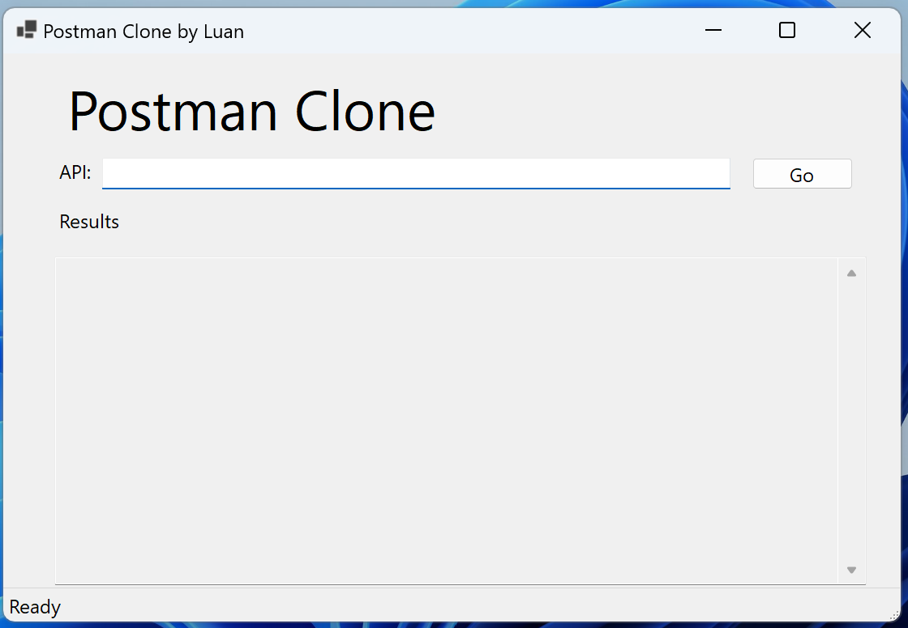
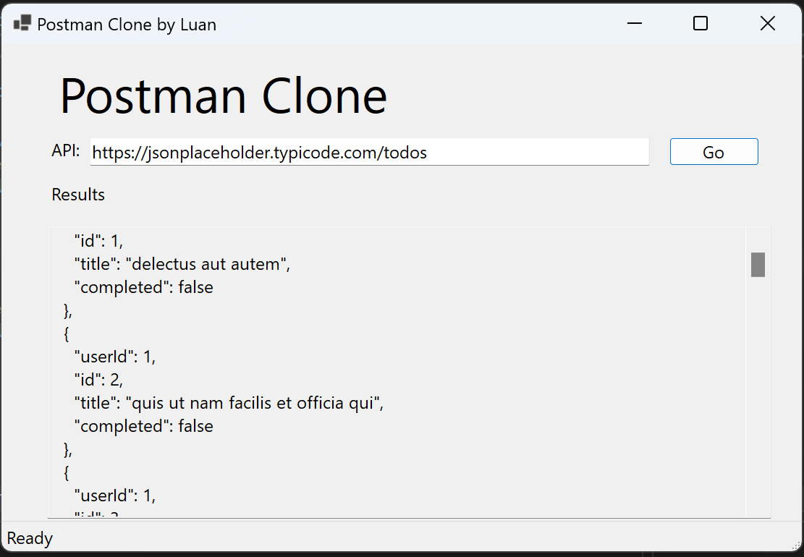

# PostmanCloneApp

Provide UI for making GET request to API and viewing the responses in formatted JSON 

## Technologies Used
* C#
* .NET 8
* WinForms
* HttpClient

## Using The App
1. Download the executable file from the release section.
2. When application launches, it should look like this:

3. Fill in your API URL and hit Go:

## Upcoming Changes
